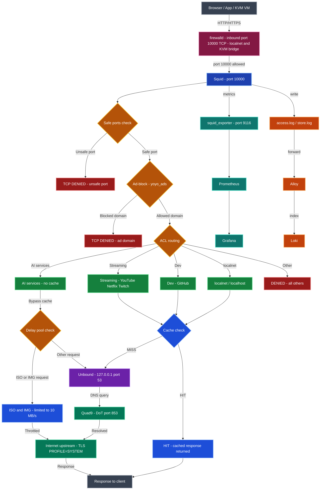

# squid-tumbleweed-config


Production-ready Squid proxy configuration for **openSUSE Tumbleweed** — optimized for multimedia streaming, AI services, privacy, and local network caching with KVM virtual machines.

---

## Overview

This configuration turns Squid into a hardened, privacy-first caching proxy for a desktop workstation running KVM/libvirt. It is designed for a setup where the host and VMs share the same proxy for all HTTP/HTTPS traffic.

Key design goals:
- **Anonymization** — strip identifying headers, replace User-Agent, disable forwarded-for
- **Ad blocking** — Peter Lowe's domain list (~3500 domains), blocks both HTTP and HTTPS
- **Selective caching** — cache static content aggressively, never cache AI service sessions
- **Streaming support** — full CDN coverage for YouTube, Twitch, Netflix, Vimeo
- **AI services** — explicit allow-list for major AI platforms with WebSocket support
- **Download throttling** — delay pools limit ISO/image downloads to 10 MB/s
- **TLS hardening** — aligned to system policy, no SSLv3/TLSv1/TLSv1.1

---

## Architecture — HTTP/HTTPS proxy flow

<sub>⚠️ If the diagram is not visible, refresh the page — Mermaid rendering may take a moment.</sub>


---

## System requirements

| Component | Version |
|-----------|---------|
| Squid | 6.x |
| openSUSE | Tumbleweed (rolling) |
| Workers | 4 (adjust to CPU core count) |
| RAM | 512 MB per worker for `cache_mem` (2 GB total minimum) |
| Disk | 1 GB for disk cache (`/var/cache/squid`) |

---

## Features

### Privacy & anonymization
- `forwarded_for delete` — removes client IP from upstream requests
- `via off` — hides proxy presence
- `httpd_suppress_version_string on` — no Squid version disclosure
- `request_header_replace User-Agent` — unified browser fingerprint
- Referer, From, and all unwhitelisted headers are stripped

### Ad blocking
- Domain-level blocking via [pgl.yoyo.org](https://pgl.yoyo.org/adservers/) (~3500 domains)
- Blocks both HTTP access and HTTPS CONNECT tunnels to ad domains

### AI services (explicit allow-list)
All sessions are excluded from cache to ensure real-time responses:

| Service | Domains |
|---------|---------|
| ChatGPT | `.openai.com` |
| Copilot | `.bing.com`, `sydney.bing.com`, `s.copilot.microsoft.com` |
| Gemini | `.google.com` |
| Claude | `.anthropic.com`, `.claude.ai` |
| Perplexity | `.perplexity.ai` |
| DeepSeek | `.deepseek.com`, `.deepseek.ai` |
| Qwen | `.qwen.ai`, `.tongyi.aliyun.com` |
| Grok | `.x.ai` |
| ZML | `.z.ai` |
| Kimi | `.kimi.ai`, `.moonshot.cn`, `.moonshot.ai` |

WebSocket (`CONNECT`) is explicitly allowed for Copilot, ZML, and Kimi.

### Streaming (full CDN coverage)

| Platform | Domains |
|----------|---------|
| YouTube | `.youtube.com`, `.googlevideo.com` |
| Twitch | `.twitch.tv`, `.ttvnw.net`, `.twitchscdn.net`, `.jtvnw.net` |
| Netflix | `.netflix.com`, `.nflxvideo.net` |
| Vimeo | `.vimeo.com`, `.vimeocdn.com` |

### Development
- GitHub: `.github.com`, `.githubusercontent.com`, `.githubassets.com`

### VPN
- NordVPN browser extension support: `.nordvpn.com`, `.nordvpn.net`

### Caching strategy

| Content | Policy |
|---------|--------|
| AI services | Never cached (`cache deny`) |
| ISO / disk images | Cached up to 1 year, 100% freshness |
| Video files (mp4/mkv/avi/flv) | Cached up to 1 year, 90% freshness |
| Images (jpg/png/gif) | Cached up to 1 year, 90% freshness |
| Everything else | 20% freshness, 3 days max |

### Download throttling (delay pools)
ISO and image downloads are throttled to **10 MB/s** (burst: 20 MB) to prevent saturating the local network during large downloads.

### TLS security
```
tls_outgoing_options cipher=PROFILE=SYSTEM
tls_outgoing_options options=NO_SSLv3,NO_TLSv1,NO_TLSv1_1
tls_outgoing_options cafile=/etc/ssl/ca-bundle.pem
```

---

## Configuration structure

```
squid.conf
├── Section 1   — Global / Workers (4 workers, file descriptors, DNS)
├── Section 2   — Listen ports (127.0.0.1:10000 + LAN IP:10000)
├── Section 3   — Network / port ACLs (localnet, SSL_ports, Safe_ports)
├── Section 4   — AI / Streaming / Dev / VPN ACLs
├── Section 5   — Ad block list (pgl_yoyo.domains)
├── Section 6   — Access rules (deny → allow AI → allow streaming → allow localnet)
├── Section 7   — Cache (deny AI, diskd 1 GB, cache_mem 512 MB, refresh patterns)
├── Section 8   — Logging
├── Section 9   — Header anonymization (request + reply)
├── Section 10  — Timeouts + refresh patterns
├── Section 10bis  — TLS outgoing security
└── Section 10ter  — Delay pools (ISO throttling 10 MB/s)
```

---

## Installation

### 1. Install Squid

```bash
sudo zypper install squid
```

### 2. Deploy configuration

```bash
sudo cp squid.conf /etc/squid/squid.conf
```

Edit the listen addresses in **Section 2** to match your network:

```
http_port 127.0.0.1:10000 tcpkeepalive=60,30,3
http_port YOUR_LOCAL_IP:10000 tcpkeepalive=60,30,3
```

### 3. Deploy the ad block list

See [`acl/README.md`](acl/README.md) for instructions to download and schedule `pgl_yoyo.domains`.

### 4. Initialize cache and start

```bash
sudo squid -z
sudo systemctl enable --now squid
```

### 5. Validate configuration

```bash
sudo squid -k parse 2>&1 | grep -E "(ERROR|FATAL|WARNING)"
```

Expected warnings (harmless):
- Duplicate entries in `pgl_yoyo.domains` — the upstream list contains overlaps
- `WARNING: HTTP requires the use of Via` — intentional, `via off` is set for anonymization

### 6. Apply changes after editing

```bash
sudo squid -k reconfigure
```

---

## Proxy configuration for clients

Set the proxy to `http://HOST_IP:10000` in:
- **Browsers** — manual proxy settings
- **System-wide** — environment variables or NetworkManager
- **KVM/libvirt VMs** — same proxy address, reachable via the bridge interface

---

## DNS integration

This configuration assumes a local **Unbound** resolver on `127.0.0.1` and `::1`:

```
dns_nameservers 127.0.0.1 ::1
dns_defnames on
```

A local DoH endpoint (`doh.lan`) is allowed through without filtering.

---

## Useful commands

```bash
# Validate configuration
sudo squid -k parse 2>&1 | grep -E "(ERROR|WARNING|FATAL)"

# Reload without restart
sudo squid -k reconfigure

# Full restart
sudo systemctl restart squid

# Test a domain through the proxy
curl -x http://127.0.0.1:10000 -I https://example.com

# Monitor live access log
sudo tail -f /var/log/squid/access.log
```

---

## Logging

| Log | Path | Note |
|-----|------|------|
| Access log | `/var/log/squid/access.log` | Buffered 16 KB, drop on error |
| Cache log | `/var/log/squid/cache.log` | Operational events |
| Store log | `/var/log/squid/store.log` | Cache object lifecycle |

Log rotation is managed externally (`logfile_rotate 0`).

---

## Contributing

Suggestions, adaptations for other distributions, and pull requests are welcome.

- Open an [issue](https://github.com/crisis1er/squid-tumbleweed-config/issues) for bugs or requests
- Join the [Discussions](https://github.com/crisis1er/squid-tumbleweed-config/discussions)

Please include your Squid version (`squid -v`) and openSUSE version in bug reports.

---

## License

GPL-3.0 License — see [LICENSE](LICENSE) for details.
